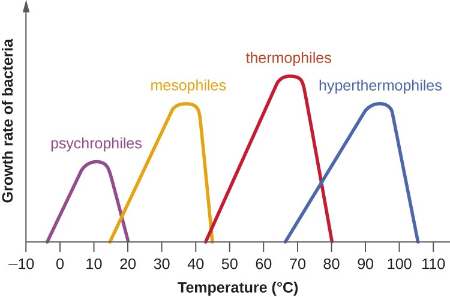

  

## ThermoDrift
Hi! Welcome to **ThermoDrift**, a user friendly tool to classify protein sequences as Thermophilic, Mesophilic, or Psychrophilic. This tool can be used for prediction, but is also an open ended tool for people to play with and adapt for the tasks they need. Look at the figure below to see what temperatures these organisms live at.

  

### Why Thermodrift: 
Thermodrift was created as an open source project that enables automated protein classification for thermophilic, mesophilic, or psychrophilic phenotypes to address the lack of any computational classifiers for thermostable protein prediction that are wisely accessible and cater to a scientific user base with little machine learning experience but a lot of enthusiasm for protein characterization. 

### Using the GUI:
NOTE: GUI with passing model is not yet operational. 

To use the Thermodrift GUI, paste the following url into your browser: "thermodrift.pythonanywhere.com".

Click the `UPLOAD FASTA FILE` button to upload a FASTA file containing the protein sequence(s) to be classified from your local computer. Each sequence will be passed through the model and display a final table including the protein sequences and their predicted mesophillic, psychrophillic, or thermophillic classification. Clicking the `DOWNLOAD CSV` button will download this table as a .csv file titled "thermodrift_output.csv" onto your local computer. 

Note: if the wrong file type or a protein sequence with unknown characters is uploaded, the user with recieve an error notifying them of the issue and the model will not be run.  

### Extracting training data from uniprot, processing and filtering data, and loading data into tensors:
To train our model, we first harvested a plethora of protein sequences from mesophillic, psychrophillic, and thermophillic organisms from the uniprot protein database. To extract thermophillic sequences we obtained all the protein sequences from species named thermophillus. Similarly, we extracted mesophillic, and psychrophillic sequences from species named psychrophillus or mesophillus.  These sequences were saved as separate .fasta files (i.e. uniprot-thermophillus.fasta).  These .fasta files are located in the <code>data_loader/data/</code> folder.  

These fasta files were separately loaded into a pandas dataframe and classified manually as either thermophillic, mesophillic, or psychrophillic by adding a class column to each dataframe.  To make sure that the model was trained on equal numbers of thermo, meso, and psychro sequences we randomly sampled 1/5 of the thermo proteins because that dataset was 5x the size of the others.  This left us with 20k sequences per class.  Then we concatenated the three dataframes into a single combined dataframe.  Next, we filtered the combined dataframe to remove sequences that didn't start with methionine or were less than 75 amino acids long.  Next, we extracted the sequences and one hot encoded them.  Sequences that were longer than 500 amino acids were cropped.  Sequences that were between 75 amino acids and 500 amino acids were padded with zeros to make the length of every one hot enocded sequence 500 amino acids. The one hot encoded sequences were saved as a tensor (unzip the <code>data_loader/tensors/tensors.zip</code> file to access X_data.pt).  Next we one hot encoded the classes of each sequence.  This was saved as a tensor (unzip the <code>data_loader/tensors/tensors.zip</code> file to access y_data.pt).  

The functions to process the training data are stored in <code>data_loader/python_files/functions.py</code>.  To run these functions use the <code>data_loader/python_files/data_loader.py</code> file.  We used the <code>data_loader/data_loader.sh</code> script to submit this job on hyak.  Use the <code>data_loader/python_files/test_functions.py</code> file to perform unit tests on the functions.py file.  

### Data processing for future model training:
Processed pytorch tensors of one-hot encoded protein sequences and their respective classification (thermophilic, mesophilic, psychrophilic) make up the X_data.pt and y_data.pt input tensors. 
X_data.pt is a tensor of shape [60000, 500, 25]. This represents 60,000 examples, where each example is a sequence of length 500 AA. Each AA in the sequence is one-hot encoded across the z-dimension. 
y_data.pt is a tensor of shape [60000, 3]. This represents 60,000 examples, where each example contains a final classification.

Functions to prepare data for training in CNN: 
split_data(X, y) takes inputs of X_data and y_data tensors. The tensors are split 80/20 into training and testing sets, respectively. 
The training tensor dataset ("trainset") is formed by concatenating the X_train and y_train tensors into a pytorch TensorDataset.
The testing tensor dataset ("testset") is formed by concatenating the X_test and y_test tensors into a pytorch TensorDataset.
The function returns trainset and testset.

make_dataloader(trainset, testset, batchsize) takes inputs of TensorDatasets trainset and testset, as well as an integer batchsize (number of examples to feed into CNN at a time). 
The training set data is shuffled after each epoch in order to prevent bias during training. The test set is not shuffled. 
The TensorDatasets are converted into pyrotch Dataloaders using torch.utils.data.DataLoader.
The function returns the dataloaders train_loader and test_loader that can be fed into the CNN for training. 

### Running training:
If youre interested in running training on a different dataset or playing around with the model, here's what to expect. The model is saved in a file called thermodrift_model.py and the training script is housed in train_script.py along with load_train_data.py which will load all of the training data. To run training, you will likely need to get access to a compute node. The training script is optimized to use GPUs if availible. The architecture is pretty simple at the moment, but layer sizes can be changed to optimize training. This same model and architecture could also be used to train on other tasks to differentiate proteins as well. 

To launch the envrinoment to use the code please install the conda environment with:

<code>conda env create -f environment.yml</code>

Code for model and functions is written with support from PyTorch, BIO, Numpy, Scipy, Pandas, Dash, and more...
